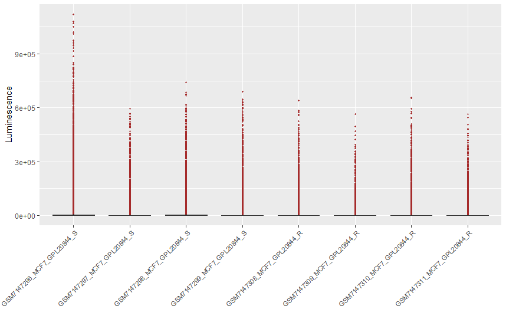

## Introducción

Este documento describe el proceso de fusion de matrices de datos de microarrays de diferentes estudios utilizando R. El objetivo es normalizar y fusionar múltiples conjuntos de datos de microarray para la posterior aplicacion de tecnicas de apredizaje automatico. 

## Librerías necesarias

Primero, cargamos las librerías necesarias para el análisis.

```{r librerias, message=FALSE, warning=FALSE}

#Librerias de manipulacion y analisis de datos
library(dplyr)
library(tidyverse)
library(AnnotationDbi)
library(reshape2)
library(preprocessCore)
library(limma)
library(sva)

#Librerias para anotacion de sondas
library(illuminaHumanv4.db)
library(hgu133a2.db)
library(hugene21sttranscriptcluster.db)

#Librerias para graficos
library(ggplot2)
library(ggrepel)

```

```{r, echo=FALSE}
load(".RData")
```

## Resumen del flujo de trabajo

1️⃣ Normalizar las matrices de expresión y estabilizar la varianza convirtiéndolas a log2.

2️⃣ Anotar las sondas.

3️⃣ Filtrar las sondas comunes a todas las matrices y fusionarlas.

4️⃣ Corregir los efectos de lote (batch effects) con Combat o SVA.


## Inicio del script

### Conversion de objetos
Primero convertimos todos los objetos de nuestro espacio de trabajo en tipos de objetos faciles de manipular como data.frames o data.tables

```{r conversion, eval=FALSE}
# Obtener nombres de todos los objetos en el espacio de trabajo
objetos <- ls()

# Recorrer cada objeto y convertirlo en data.frame (si es posible)
for (obj in objetos) {
  temp <- get(obj, envir = .GlobalEnv)  # Obtener el objeto
  
  # Verificar si es una matriz
  if (is.matrix(temp)) {
    assign(obj, as.data.frame(temp), envir = .GlobalEnv)  # Convertir a data.frame
  }
}
```

### Anotacion de sondas

Ahora procederemos a anotar las sondas de cada modelo de microarrays. Recuerda que cada uno tiene su propia librería de anotación específica. La información de la anotación se puede descargar desde la base de datos GEO, accediendo al código de la plataforma correspondiente

**a) Serie GSE98987**

Esta plataforma contiene información transcriptómica, así como resultados de calidad que arroja el modelo de chip de marca Illumina. Dado que solo nos interesa la información transcriptómica, filtraremos algunas columnas para conservar únicamente los datos relevantes.

```{r, eval=FALSE}

# Obtener los IDs de las sondas de la columna 'ID_REF' en el objeto GSE98987_exp
sondas <- as.vector(GSE98987_exp$ID_REF)

# Mapear los IDs de las sondas a los nombres de genes (SYMBOL) usando la base de datos 'illuminaHumanv4.db'
genes <- mapIds(illuminaHumanv4.db, keys = sondas, column = "SYMBOL", keytype = "PROBEID", multiVals = "first")

# Convertir el resultado de 'mapIds' en un data.frame
genes <- as.data.frame(genes)

# Añadir la columna 'ID_REF' con los identificadores de las filas como nueva columna
genes$ID_REF <- row.names(genes)

# Reordenar las columnas para que 'ID_REF' esté primero y luego 'genes'
genes <- genes[, c("ID_REF", "genes")]

# Unir los datos de expresión de GSE98987_exp con los datos de genes, utilizando 'ID_REF' como clave
merge87 <- merge(genes, GSE98987_exp, by = "ID_REF")

# Agrupar los datos por nombre de gen ('genes') y calcular el promedio de las expresiones por gen
merge87 <- merge87 %>%
  group_by(genes) %>%
  summarise(across(where(is.numeric), mean, na.rm = TRUE))

# Eliminar columnas que contienen "Pval" en el nombre (valores p)
merge87 <- merge87[, !grepl("Pval", colnames(merge87))]

```

**b) Serie GSE229002**

```{r, eval=FALSE}
# Obtener los nombres de las sondas de la columna 'names' en el objeto GSE229002_exp
sondas <- as.vector(GSE229002_exp$names)

# Leer la anotación desde el archivo 'GPL20844-88004.txt' que en este caso fue descarga de la base de datos GEO como un archivo txt
anotacion_02 <- read.delim("/GPL20844-88004.txt")

# Asignar los nombres de las sondas a 'ID_REF' y convertirlo en un data.frame
ID_REF <- GSE229002_exp$names
ID_REF <- as.data.frame(ID_REF)

# Filtrar columnas relevantes de la matriz de anotación (solo ciertas columnas)
anotacion_02 <- anotacion_02[, c(4, 7, 8, 10, 13, 13)]

# Renombrar la columna 'ID_REF' como 'Gen_Code'
ID_REF <- ID_REF %>%
  rename(Gen_Code = ID_REF)

# Hacer un 'left_join' entre 'ID_REF' y la anotación, pivotando la anotación para facilitar la unión
genes <- ID_REF %>%
  left_join(anotacion_02 %>%
              pivot_longer(cols = -GENE_SYMBOL, values_to = "Gen_Code"), 
            by = "Gen_Code", relationship = "many-to-many") %>%
  distinct()  # Elimina duplicados exactos de la unión

# Renombrar la primera columna de 'GSE229002_exp' a 'Gen_Code' para poder unir los datos correctamente
colnames(GSE229002_exp)[1] = "Gen_Code"

# Unir la información de genes con los datos de expresión usando 'Gen_Code' como clave
merge02 <- merge(genes, GSE229002_exp, by = "Gen_Code")

# Eliminar la tercera columna del dataframe, que probablemente no es necesaria
merge02 <- merge02[, -3]

# Eliminar duplicados en el dataframe
merge02 <- merge02 %>% distinct()

# Eliminar filas que contienen NA (valores faltantes)
merge02 <- na.omit(merge02)

# Convertir todas las columnas a tipo character, luego reemplazar los valores vacíos ("") por NA, y eliminar filas con cualquier NA
merge02 <- merge02 %>%
  mutate(across(everything(), as.character)) %>%  # Convierte todas las columnas a character
  mutate(across(everything(), ~ na_if(.x, ""))) %>%  # Reemplaza "" por NA
  drop_na()  # Elimina filas con al menos un NA

# Convertir todas las columnas numéricas (excepto 'GENE_SYMBOL' y 'Gen_Code') a tipo numérico
merge02 <- merge02 %>%
  mutate(across(-c(GENE_SYMBOL, Gen_Code), as.numeric))

# Eliminar la primera columna ('Gen_Code') después de la conversión
merge02 <- merge02[, -1]

# Agrupar por el símbolo del gen ('GENE_SYMBOL') y calcular el promedio de las expresiones por gen
merge02 <- merge02 %>%
  group_by(GENE_SYMBOL) %>%
  summarise(across(where(is.numeric), mean, na.rm = TRUE))


```

**c) Serie GSE117742**

```{r, eval=FALSE}
# Extraer la anotación en un data.frame
annotation_df <- data.frame(
  probe_id = keys(hgu133a2.db, keytype = "PROBEID"),  # Obtener las sondas
  gene_symbol = mapIds(hgu133a2.db, keys = keys(hgu133a2.db, keytype = "PROBEID"), 
                       column = "SYMBOL", keytype = "PROBEID", multiVals = "first"),
  stringsAsFactors = FALSE
)

# Unir la anotación con tu dataset
GSE117742_exp<-as.data.frame(GSE117742_exp)
GSE117742_exp$ID_REF=row.names(GSE117742_exp)
merge42 <- GSE117742_exp %>%
  left_join(annotation_df, by = c("ID_REF" = "probe_id"))

merge42<-merge42[,-7]

merge42 <- merge42 %>%
  group_by(gene_symbol) %>%
  summarise(across(where(is.numeric), mean, na.rm = TRUE))

merge42<-na.omit(merge42)

row.names(merge42)=merge42$gene_symbol
```

**d) Serie GSE155570**

```{r, eval=FALSE}
# Extraer la anotación en un data.frame
annotation_df <- data.frame(
  probe_id = keys(hgu133a2.db, keytype = "PROBEID"),  # Obtener las sondas (IDs de las sondas)
  
# Mapear las sondas a los nombres de genes (SYMBOL) usando la base de datos 'hgu133a2.db'
  gene_symbol = mapIds(hgu133a2.db, keys = keys(hgu133a2.db, keytype = "PROBEID"), 
                       column = "SYMBOL", keytype = "PROBEID", multiVals = "first"),
  
# Evitar que los valores sean factores
  stringsAsFactors = FALSE
)

# Convertir el dataset 'GSE117742_exp' a data.frame y agregar la columna 'ID_REF' con los nombres de fila
GSE117742_exp <- as.data.frame(GSE117742_exp)
GSE117742_exp$ID_REF = row.names(GSE117742_exp)

# Unir la anotación con el dataset de expresión usando 'ID_REF' y 'probe_id' como clave
merge42 <- GSE117742_exp %>%
  left_join(annotation_df, by = c("ID_REF" = "probe_id"))

# Eliminar la séptima columna del dataframe, que probablemente no es relevante
merge42 <- merge42[, -7]

# Agrupar los datos por el símbolo del gen ('gene_symbol') y calcular el promedio de las expresiones por gen
merge42 <- merge42 %>%
  group_by(gene_symbol) %>%
  summarise(across(where(is.numeric), mean, na.rm = TRUE))

# Eliminar filas con valores faltantes (NA)
merge42 <- na.omit(merge42)

# Establecer el nombre de fila como el símbolo del gen
row.names(merge42) = merge42$gene_symbol

```

### Renombrado de muestras

Para facilitar la identificación de las muestras al fusionar los conjuntos de datos mediante ComBat o SVA, se procederá a renombrar las muestras de cada dataset. El formato de nomenclatura que se utilizará será el siguiente:

CódigoDeMuestra_LineaCelular_Plataforma_Condición

Donde:

CódigoDeMuestra: Corresponde al identificador único de la muestra (por ejemplo, GSM2629622).

LineaCelular: Indica la línea celular utilizada en el experimento (por ejemplo, MCF7 o T47D).

Plataforma: Especifica la plataforma de microarray empleada (por ejemplo, GPL10558).
Condición: Describe la condición experimental, que puede ser sensible (S) o resistente (R).

Para hacer esto puedes armar una funcion (si tus tablas de metadatos tienen toda la informacion que neceistas con nombes de columna similares) o bien copiar los colnames de las matirces una por una y armar los nombres en excel en buscando los datos  que necesitas y luego reemplazarlos, en este caso dado las diferencias en lso nombres de columna en los metadatos de cada serie, decidi armas los nombres manualmente, ahor alos reemplazare en cada serie: 

```{r, eval=FALSE}

colnames(merge87)[2:24]=c("GSM2629622_MCF7_GPL10558_S",	"GSM2629623_MCF7_GPL10558_S",	"GSM2629624_MCF7_GPL10558_R",	"GSM2629625_MCF7_GPL10558_R",	"GSM2629626_MCF7_GPL10558_R",	"GSM2629627_MCF7_GPL10558_S",	"GSM2629628_MCF7_GPL10558_S",	"GSM2629629_MCF7_GPL10558_S",	"GSM2629630_MCF7_GPL10558_R",	"GSM2629631_MCF7_GPL10558_R",	"GSM2629632_MCF7_GPL10558_R",	"GSM2629633_MCF7-LTED_GPL10558_S",	"GSM2629634_MCF7-LTED_GPL10558_S",	"GSM2629635_MCF7-LTED_GPL10558_S",	"GSM2629636_MCF7-LTED_GPL10558_R",	"GSM2629637_MCF7-LTED_GPL10558_R",	"GSM2629638_MCF7-LTED_GPL10558_R",	"GSM2629639_T47D_GPL10558_S",	"GSM2629640_T47D_GPL10558_S",	"GSM2629641_T47D_GPL10558_S",	"GSM2629642_T47D_GPL10558_R",	"GSM2629643_T47D_GPL10558_R",	"GSM2629644_T47D_GPL10558_R")

colnames(merge02)[2:9]=c("GSM7147296_MCF7_GPL20844_S",	"GSM7147297_MCF7_GPL20844_S",	"GSM7147298_MCF7_GPL20844_S",	"GSM7147299_MCF7_GPL20844_S",	"GSM7147308_MCF7_GPL20844_R",	"GSM7147309_MCF7_GPL20844_R",	"GSM7147310_MCF7_GPL20844_R",	"GSM7147311_MCF7_GPL20844_R")

colnames(merge42)[2:7]=c("GSM3308120_T47D_GPL571_S", "GSM3308121_T47D_GPL571_S", "GSM3308122_T47D_GPL571_S", "GSM3308123_T47D_GPL571_R", "GSM3308124_T47D_GPL571_R", "GSM3308125_T47D_GPL571_R")

colnames(merge70)[2:13]=c("GSM4706336_MCF7_GPL17692_S",	"GSM4706337_MCF7_GPL17692_S",	"GSM4706338_MCF7_GPL17692_S",	"GSM4706339_MCF7_GPL17692_R",	"GSM4706340_MCF7_GPL17692_R",	"GSM4706341_MCF7_GPL17692_R",	"GSM4706342_MCF7_GPL17692_S",	"GSM4706343_MCF7_GPL17692_S",	"GSM4706344_MCF7_GPL17692_S",	"GSM4706345_MCF7_GPL17692_R",	"GSM4706346_MCF7_GPL17692_R",	"GSM4706347_MCF7_GPL17692_R")

colnames(merge70)[35:40]=c("GSM4706369_MCF7_GPL17692_S",	"GSM4706370_MCF7_GPL17692_S",	"GSM4706371_MCF7_GPL17692_S",	"GSM4706372_MCF7_GPL17692_S",	"GSM4706373_MCF7_GPL17692_S","GSM4706374_MCF7_GPL17692_S")

colnames(merge70)[14:34]=c("GSM4706348_T47D_GPL17692_S",	"GSM4706349_T47D_GPL17692_S",	"GSM4706350_T47D_GPL17692_S",	"GSM4706351_T47D_GPL17692_S",	"GSM4706352_T47D_GPL17692_S",	"GSM4706353_T47D_GPL17692_S",	"GSM4706354_T47D_GPL17692_R",	"GSM4706355_T47D_GPL17692_R",	"GSM4706356_T47D_GPL17692_R",	"GSM4706357_T47D_GPL17692_S",	"GSM4706358_T47D_GPL17692_S",	"GSM4706359_T47D_GPL17692_S",	"GSM4706360_T47D_GPL17692_R",	"GSM4706361_T47D_GPL17692_R",	"GSM4706362_T47D_GPL17692_R",	"GSM4706363_T47D_GPL17692_S",	"GSM4706364_T47D_GPL17692_S",	"GSM4706365_T47D_GPL17692_S",	"GSM4706366_T47D_GPL17692_R",	"GSM4706367_T47D_GPL17692_R",	"GSM4706368_T47D_GPL17692_R")

```

### Normalizacion de matrices

El siguiente paso en nuestro análisis es la normalización de las matrices de expresión génica. Es importante tener en cuenta que nuestras matrices provienen de diferentes chips de microarrays, y cada uno puede tener ya su propio método de normalización aplicado. Por lo tanto, antes de aplicar un proceso de normalización adicional, es fundamental verificar si los datos ya fueron normalizados por los autores. Una forma sencilla de determinar si los datos ya han sido procesados es revisar el nombre del archivo descargado desde la base de datos. Si el archivo incluye el término "RAW", es probable que los datos aún no hayan sido normalizados y que necesiten un ajuste previo a cualquier análisis. En cambio, si el archivo no tiene "RAW" en su nombre, podría indicar que ya se han aplicado técnicas de normalización, lo que nos permitiría omitir este paso. Otra forma es realizar un grafico de boxplot para corroborar la distribucion de los valores de expresion.

Recuerda que la normalización es crucial porque las distintas plataformas de microarrays pueden introducir variabilidad técnica que no está relacionada con la biología del experimento. Sin una normalización adecuada, estas diferencias pueden distorsionar los resultados y dificultar la comparación de los datos.

Por lo tanto, asegúrate de realizar la normalización solo cuando sea necesario, y verifica el estado de los datos antes de proceder para evitar hacer un trabajo innecesario.

Empecemos...

**a) Serie GSE22900**

Hacemos un primer boxplot para explorar la distribución de los datos 

```{r, eval=FALSE}
data_long <- melt(merge02)
# Crear el gráfico con ggplot2
ggplot(data_long, aes(x = variable, y = value)) +
  geom_boxplot(
    aes(fill = variable),          # Colorear las cajas según la variable
    outlier.color = "brown",       # Color de los outliers (bordo)
    outlier.shape = 19,            # Forma de los outliers (círculo relleno)
    outlier.size = 0.8,             # Tamaño de los outliers
    lwd = 0.3,                     # Grosor de las líneas de borde (más delgadas)
    fatten = 1                     # Grosor de la línea de la mediana
  ) +
  theme(
    axis.text.x = element_text(angle = 45, hjust = 1, size = 8),  # Etiquetas del eje X a 45 grados
    legend.position = "none",# Eliminar la leyenda
    plot.margin = margin(10, 10, 10, 40)
  ) +
  labs(y = "Luminescence", x = "") +
  scale_fill_manual(values = rep("gray", length(unique(data_long$variable))))

```
```{r,echo=FALSE, out.width="70%"}

```

El boxplot muestra que los datos tienen una distribución extremadamente sesgada, con una gran cantidad de valores atípicos (outliers) en la parte superior. Esto sugiere que los valores de expresión tienen una escala muy amplia en valores crudos. No estan nomalizados.

Vamos primero a normalizarlos y luego a convertir a log. En los chips de Illumina la nomralizacion mas similar a la RMA de Affymetrix es la normalizacion cuantílica + transformacion logaritmica.

```{r, eval=FALSE}
# Normalización cuantílica de las muestras (eliminando la primera columna que es el el nombre del gen)
merge02_norm <- normalize.quantiles(as.matrix(merge02[,-1]))  # Convierte a matriz y normaliza las columnas (muestras)

# Asigna los nombres de fila originales (que corresponden a los genes) a la matriz normalizada
rownames(merge02_norm) <- rownames(merge02)  # Asegura que las filas de la matriz normalizada corresponden a los mismos genes

# Asigna los nombres de las columnas (muestras) a la matriz normalizada
colnames(merge02_norm) <- colnames(merge02[,-1])  # Omite la primera columna (ID_REF) que son lso nombres de los genes

# Aplica una transformación logarítmica en base 2 a los valores normalizados, sumando 1 para evitar problemas con valores cero
merge02_normlog <- log2(merge02_norm + 1)  # Log-transformación de los datos para mejorar su distribución y análisis posterior.

```

Hacemos de nuevo el boxplot

```{r}
data_long <- as.data.frame(melt(merge02_normlog))
# Crear el gráfico con ggplot2
ggplot(data_long, aes(x = Var2, y = value)) +
  geom_boxplot(
    aes(fill = Var2),          # Colorear las cajas según la variable
    outlier.color = "brown",       # Color de los outliers (bordo)
    outlier.shape = 19,            # Forma de los outliers (círculo relleno)
    outlier.size = 0.8,              # Tamaño de los outliers
    lwd = 0.3,                     # Grosor de las líneas de borde (más delgadas)
    fatten = 1                     # Grosor de la línea de la mediana
  ) +
  theme(
    axis.text.x = element_text(angle = 45, hjust = 1, size = 8),  # Etiquetas del eje X a 45 grados
    legend.position = "none",# Eliminar la leyenda
    plot.margin = margin(10, 10, 10, 40)
  ) +
  labs(y = "Luminescence", x = "") +
  scale_fill_manual(values = rep("gray", length(unique(data_long$Var2))))
```

Se observa que la distribucion de los valores de intesidad mejoro mucho.

Vamos a evaluar la densidad de los valores de intensidad a traves de un histograma. Dado que la normalización busca hacer que los datos de todas las muestras tengan la misma distribución esperamos que el histograma muestre una distribución homogénea, sin un  desplazamiento importante de los picos para cada muestra dentro del estudio.

```{r}
plot(NULL, xlim = c(0, 15), ylim = c(0, 0.5), xlab = "Expresión", ylab = "Densidad", 
     main = "Distribución de intensidades", type = "n")

for (i in 1:ncol(merge02_normlog)) {
  lines(density(merge02_normlog[, i], na.rm = TRUE), col = i)
}
```

Vemos que la distribucion es simetrica y  los picos no se separan demasiado.  Si vieramos que algunas muestras tienen picos muy desplazados a la derecha o a la izquierda, esto puede indicar diferencias en la escala de intensidades entre muestras, lo cual sugiere que la normalización no ha sido suficiente.

En teminos generales: 

🔹Un pico más ancho y bajo sugiere que la muestra tiene una mayor dispersión en los valores de expresión.

🔹 Un pico más delgado y alto indica una menor variabilidad en los datos ( es decir, mayoría de los valores de expresion están muy concentrados en un rango estrecho).

**b) Serie GSE117742**

Los archivos .CEL de esta matriz fueron descargados y previmante normalizados por RMA (ver scrip/guia de descarga de datos).

```{r, message=FALSE, warning=FALSE}
data_long <- melt(merge42)
# Crear el gráfico con ggplot2

ggplot(data_long, aes(x = variable, y = value)) +
  geom_boxplot(
    aes(fill = variable),          # Colorear las cajas según la variable
    outlier.color = "brown",       # Color de los outliers (bordo)
    outlier.shape = 19,            # Forma de los outliers (círculo relleno)
    outlier.size = 0.8,              # Tamaño de los outliers
    lwd = 0.3,                     # Grosor de las líneas de borde (más delgadas)
    fatten = 1                     # Grosor de la línea de la mediana
  ) +
  theme(
    axis.text.x = element_text(angle = 45, hjust = 1, size = 8),  # Etiquetas del eje X a 45 grados
    legend.position = "none",# Eliminar la leyenda
    plot.margin = margin(10, 10, 10, 40)
  ) +
  labs(y = "Luminescence", x = "") +
  scale_fill_manual(values = rep("gray", length(unique(data_long$variable))))


```


```{r}
plot(NULL, xlim = c(0, 15), ylim = c(0, 0.5), xlab = "Expresión", ylab = "Densidad", 
     main = "Distribución de intensidades", type = "n")

merge42_numeric<-as.matrix(merge42[,-1])
row.names(merge42_numeric)=merge42$gene_symbol

for (i in 1:ncol(merge42_numeric)) {
  lines(density(merge42_numeric[, i], na.rm = TRUE), col = i)
}
```

El density plot o histograma muestra una distribución amplia en todas la muestras, sin un pico definido. Esto sugiere que los datos de expresión génica abarcan un amplio rango de intensidades. La falta de un pico definido puede deberse a la presencia de múltiples subpoblaciones de genes con diferentes niveles de expresión, lo que es común en datos  transcriptomicos. Además, la ausencia de un pico pronunciado podría indicar que no hay un grupo dominante de genes, sino una distribución más uniforme o multimodal.

Sin embargo, es importante destacar que tanto el boxplots, como el histograma muestran una buena consistencia entre las muestras, es decir todas sifuen la misma distribucion, no hay muestras diferentes, lo que sugiere que la normalización y la transformación logarítmica han funcionado correctamente en términos de igualar las medianas y la dispersión. Por lo tanto, la forma del density plot no necesariamente indica un problema con los datos, sino más bien una característica intrínseca de la distribución de la expresión génica en este conjunto de datos en particular.

**c) Serie GSE155570**

```{r, warning=FALSE, message=FALSE}

data_long <- melt(merge70)

# Crear el gráfico con ggplot2
ggplot(data_long, aes(x = variable, y = value)) +
  geom_boxplot(
    aes(fill = variable),          # Colorear las cajas según la variable
    outlier.color = "brown",       # Color de los outliers (bordo)
    outlier.shape = 19,            # Forma de los outliers (círculo relleno)
    outlier.size = 0.8,              # Tamaño de los outliers
    lwd = 0.3,                     # Grosor de las líneas de borde (más delgadas)
    fatten = 1                     # Grosor de la línea de la mediana
  ) +
  theme(
    axis.text.x = element_text(angle = 45, hjust = 1, size = 8),  # Etiquetas del eje X a 45 grados
    legend.position = "none",# Eliminar la leyenda
    plot.margin = margin(10, 10, 10, 40)
  ) +
  labs(y = "Luminescence", x = "") +
  scale_fill_manual(values = rep("gray", length(unique(data_long$variable))))
```

Para este estudio en particular al realizar el boxplot vemos que los datos ya estaban normalizados por los autores y los han subido asi. Si chequamos los metadatos de la serie, vemos que detallan que utilizaron RMA para la normalizacion. 

```{r}
plot(NULL, xlim = c(0, 15), ylim = c(0, 0.5), xlab = "Expresión", ylab = "Densidad", 
     main = "Distribución de intensidades", type = "n")

merge70_numeric<-as.matrix(merge70[,-1])
row.names(merge70_numeric)=merge70$GENE_SYMBOL

for (i in 1:ncol(merge70_numeric)) {
  lines(density(merge70_numeric[, i], na.rm = TRUE), col = i)
  }
```

**e) Serie GSE98987**

```{r, message=FALSE, warning=FALSE}
data_long <- melt(merge87)
# Crear el gráfico con ggplot2
ggplot(data_long, aes(x = variable, y = value)) +
  geom_boxplot(
    aes(fill = variable),          # Colorear las cajas según la variable
    outlier.color = "brown",       # Color de los outliers (bordo)
    outlier.shape = 19,            # Forma de los outliers (círculo relleno)
    outlier.size = 0.8,              # Tamaño de los outliers
    lwd = 0.3,                     # Grosor de las líneas de borde (más delgadas)
    fatten = 1                     # Grosor de la línea de la mediana
  ) +
  theme(
    axis.text.x = element_text(angle = 45, hjust = 1, size = 8),  # Etiquetas del eje X a 45 grados
    legend.position = "none",# Eliminar la leyenda
    plot.margin = margin(10, 10, 10, 40)
  ) +
  labs(y = "Luminescence", x = "") +
  scale_fill_manual(values = rep("gray", length(unique(data_long$variable))))
```

Observamos que estos datos no están normalizados. Procedemos a normalizarlos utilizando el método de normalización cuantílica, ya que los autores no ha puesto a disposicon los archivos .CEL para aplicar el método RMA. Esta técnica de normalización es la más adecuada en este caso, ya que ofrece un resultado aproximado al de RMA. 

```{r, eval=FALSE}
merge87_norm <- normalize.quantiles(as.matrix(merge87[,-1]))
merge87_normlog <- log2(merge87_norm + 1)
rownames(merge87_normlog) <- rownames(merge87)
colnames(merge87_normlog) <- colnames(merge87[,-1])
```

Corroboramos que la normalizacion haya sido exitosa:

```{r}
data_long <- as.data.frame(melt(merge87_normlog))
# Crear el gráfico con ggplot2
ggplot(data_long, aes(x = Var2, y = value)) +
  geom_boxplot(
    aes(fill = Var2),          # Colorear las cajas según la variable
    outlier.color = "brown",       # Color de los outliers (bordo)
    outlier.shape = 19,            # Forma de los outliers (círculo relleno)
    outlier.size = 0.8,              # Tamaño de los outliers
    lwd = 0.3,                     # Grosor de las líneas de borde (más delgadas)
    fatten = 1                     # Grosor de la línea de la mediana
  ) +
  theme(
    axis.text.x = element_text(angle = 45, hjust = 1, size = 8),  # Etiquetas del eje X a 45 grados
    legend.position = "none",# Eliminar la leyenda
    plot.margin = margin(10, 10, 10, 40)
  ) +
  labs(y = "Luminescence", x = "") +
  scale_fill_manual(values = rep("gray", length(unique(data_long$Var2))))
```

Observamos que existen numerosos outliers en la distribución, lo cual se debe a que la normalización por RMA incluye un paso adicional que la normalización cuantílica no contempla: la corrección de las sondas con valores cercanos al fondo del microarreglo. Para investigar esto, veamos si hay muchas sondas con valores bajos utilizando un histograma.

```{r}
plot(NULL, xlim = c(0, 15), ylim = c(0, 0.5), xlab = "Expresión", ylab = "Densidad", 
     main = "Distribución de intensidades", type = "n")

for (i in 1:ncol(merge87_normlog)) {
  lines(density(merge87_normlog[, i], na.rm = TRUE), col = i)
}
```

En el density plot o histograma se ve claramente que este es el problema, hay muchas sondas con baja expresion cercana al fondo, vamos a filtrarlas estableciendo un umbral para corregir el inconveniente:

```{r}
#Primero vamos a calcular la expresion media de cada sonda para decidir que vamos a considerar como "baja expresion":
expression_means <- as.data.frame(rowMeans(merge87_normlog))
summary(expression_means)

```
El primer cuartil (5.959) representa el valor por debajo del cual se encuentra el 25% de las sondas con menor expresión.Filtrar las sondas por debajo de este valor eliminará el 25% de estas. Podriamos elegir un umbral de 6.0 (redondeando el primer cuartil).

```{r,eval=FALSE}
merge87_filtered <- merge87_normlog[rowMeans(merge87_normlog) > 6, ]
```

```{r}
dim(merge87_filtered)
```
Vemos que pasamos de 21186 sondas a 14551, veamos si el density plot ahora tiene sentido

```{r}
plot(NULL, xlim = c(0, 15), ylim = c(0, 0.5), xlab = "Expresión", ylab = "Densidad", 
     main = "Distribución de intensidades", type = "n")

for (i in 1:ncol(merge87_filtered)) {
  lines(density(merge87_filtered[, i], na.rm = TRUE), col = i)
}
```

Vemos que la densidad de los valores de expresion mejoro bastante, podriamos usar un valor mas cercano a la mediana, pero hay que encontrar un balence entre perdida de informacion y ruido de los datos.

### Union de las matrices

Ya tenemos nuestras matrices anotadas, normalizadas y, si es necesario, filtradas. Además, todas han sido transformadas a log2. Ahora, comencemos encontrando los genes comunes en todas las matrices, para eso necesitamos comparar los nombres de los genes que anotamos, vamos a crear en cada matriz una columna llamda "gene_symbol" y luego la vamos a extraer y guardar en un objeto que nos ervira para crear una lista de nombres de genes para cada amtriz y luego compararlas entre si. 

```{r, eval=FALSE}
# Listar las matrices y asignarles un nombre a cada una
matrices <- list(
  merge02_normlog = merge02_normlog,
  merge42_numeric = merge42_numeric,
  merge70_numeric = merge70_numeric,  
  merge87_filtered = merge87_filtered  
)

# Creé una función que agrega una columna llamada gene_symbol a cada matriz, extrayendo los nombres de los genes como una lista. Luego, asigna un nombre único a cada lista, con un número al final que indica de qué matriz proviene

extraer_genes <- function(matrices) {
  nombres_matrices <- names(matrices)  # Obtener los nombres de las matrices en la lista de nombres
  
  for (i in seq_along(matrices)) {  # Recorrer cada matriz en la lista
    sufijo <- gsub("\\D", "", nombres_matrices[i])  # Elimina todos los caracteres no numéricos del nombre de la amtriz
    
    # Crear un data frame con los nombres de los genes (filas) de la matriz
    df <- data.frame(gene_symbol = rownames(matrices[[i]]), stringsAsFactors = FALSE)
    
    # Asignar el nombre  "gene_symbol" a la nueva columna con los row.names
    colnames(df) <- "gene_symbol"
    
    # Crear un df con el nombre genes+ ultimos dos digitos del nombre de la serie en el entorno global
    assign(paste0("genes", sufijo), df, envir = .GlobalEnv)  #(genes02, genes42, etc.)
  }
}

# Ejecutar la función para extraer los genes de cada matriz
extraer_genes(matrices)

# Crear una lista de listas con los nombres de los genes de todas las matrices generadas
listas_de_genes <- list(genes02$gene_symbol, genes42$gene_symbol, genes70$gene_symbol, genes87$gene_symbol)

# Obtener los nombres de genes comunes a todas las listas utilizando la función 'Reduce' y 'intersect'
genes_comunes <- Reduce(intersect, listas_de_genes) 

# Filtrar cada matriz para que solo contenga los genes comunes
merge02_comunes <- merge02_normlog[rownames(merge02_normlog) %in% genes_comunes, ]
merge42_comunes <- merge42_numeric[rownames(merge42_numeric) %in% genes_comunes, ]
merge70_comunes <- merge70_numeric[rownames(merge70_numeric) %in% genes_comunes, ]
merge87_comunes <- merge87_filtered[rownames(merge87_filtered) %in% genes_comunes, ]
```

```{r}
dim(merge02_comunes)
dim(merge42_comunes)
dim(merge70_comunes)
dim(merge87_comunes)
```

Ahora que los dataframes tienen el mismo numero de filas, podemos unirlos:
```{r, eval=FALSE}
# Reordenar las filas en todos los dataframes según los nombres de los genes
genes_ordenados <- rownames(merge02_comunes)  # Tomamos un orden de referencia
merge42_comunes <- merge42_comunes[genes_ordenados, ]
merge70_comunes <- merge70_comunes[genes_ordenados, ]
merge87_comunes <- merge87_comunes[genes_ordenados, ]

# Unir los dataframes por columnas
matriz_combinada <- cbind(merge02_comunes, merge42_comunes, merge70_comunes, merge87_comunes)

matriz_combinada <- na.omit(matriz_combinada)  
```

```{r}
# Verificar dimensiones
dim(matriz_combinada)
```
Vamos a evaluar la distribucion de los valores de expresion en la nueva matriz:
```{r}
summary(as.vector(matriz_combinada))  
hist(as.vector(matriz_combinada), breaks = 50, main = "Distribución de la expresión")
```

El histograma muestra una distribución sesgada hacia la derecha, pero no parece haber valores extremos.

Para aplicar los algoritmos de corrección de efectos de fondo, necesitamos construir una matriz de metadatos para la matriz combinada.

Primero, generaremos los vectores de efectos de fondo, que reflejan las diferencias entre las muestras. El principal efecto que buscamos eliminar es el asociado a la plataforma de secuenciación.

Además, crearemos un vector adicional para indicar al algoritmo qué efecto no debe modificar, es decir, la variable que debe conservar sin cambios. En este caso, se trata de las condiciones sensible/resistente.

```{r, eval=FALSE}
plataformas <- c(rep(1, 8), rep(2, 6), rep(3, 21), rep(4, 23))
```

Para crear el vector de condiciones vamso a unar la teminacion R/S del nombre de las muestras:

```{r, eval=FALSE}
# Extraer los nombres de las columnas de la matriz combinada
muestras <- colnames(matriz_combinada)

# Crear un vector de condición basado en la última letra del nombre de cada muestra
condicion <- ifelse(grepl("R$", muestras), "Resistente", "Sensible")

# Verificar el resultado
table(condicion)  # Para ver el número de muestras en cada categoría

#Transformar a un vector numerico
condicion <- ifelse(condicion == "Sensible", 1, 2)
```

Armamos la matriz de metadatos basica ( se le puede agregar mas informacion de ser necesario): 

```{r, eval=FALSE}
nombres_muestras<-colnames(matriz_combinada)

metadata_combinada<-data.frame(ID_muestra = nombres_muestras, condicion = condicion, ID_PL=plataformas)
metadata_combinada$condicion<-as.factor(metadata_combinada$condicion)
metadata_combinada$ID_PL<-as.factor(metadata_combinada$ID_PL)

```

Antes de iniciar la correccion de los efectos de fondo vamos a hacer un PCA explotario en el que esperamos observar cluster de muestras correspondientes a cada plataforma (este es el efecto que queremos eliminar).
```{r}
# Transponer la matriz para que las muestras sean filas y los genes columnas
matriz_t <- t(matriz_combinada)

# Calcular PCA
pca <- prcomp(matriz_t, scale. = TRUE)

# Crear un dataframe con las coordenadas del PCA
pca_df <- as.data.frame(pca$x)

# Agregar las etiquetas de plataforma y condición
pca_df$Plataforma <- rep(c("GPL20844", "GPL571", "GPL17692", "GPL10558"), 
                         times = c(8, 6, 21, 23))  # Ajustar según el número de muestras por plataforma

pca_df$Condicion <- ifelse(grepl("R$", colnames(matriz_combinada)), "Resistente", "Sensible")

# Asignar formas y colores
formas <- c("Sensible" = 17, "Resistente" = 16)  # Triángulo para sensible (17), círculo para resistente (16)
colores <- c("GPL20844" = "red", "GPL571" = "blue", "GPL17692" = "green", "GPL10558" = "purple")

# Graficar PCA
ggplot(pca_df, aes(x = PC1, y = PC2, color = Plataforma, shape = Condicion)) +
  geom_point(size = 1.5) +
  scale_color_manual(values = colores) +
  scale_shape_manual(values = formas) +
  labs(title = "PCA antes de aplicar Combat/SVA",
       x = "PC1",
       y = "PC2") +
  theme_minimal()

```

Para eliminar los efectos de lote en nuestros datos, aplicaremos primero dos métodos distintos en principio por separado: Combat y SVA. Cada uno está diseñado para manejar diferentes tipos de variabilidad en los datos de expresión génica. A veces, si uno de ellos no es suficiente pare reducir totalmente los efectos de lote puede combinarse. Generalmente cuando se combinan, primero se aplica Combat para remover efectos conocidos y luego SVA para elminar cualquier variacion residual no controlada. 

Para saber si aplicar solo un metodo es suficiente, se debe realizar un ANOVA entre las plataformas, si las diferencias entre las mismas fueron resueltas, el ANOVA arrojara un resultado no significativo (un valor de p-value menor a 0.05). Tambien es combeniente realizar una prueba de contrastes multiples despues del ANOVA para detectar cuales son los pares de plataforrmas problematicos.

Aqui hay mas informacion sobre para que sirve cada metodo: 

1️⃣ Combat
El método Combat es ideal cuando se asume que los únicos efectos no biológicos que afectan los datos son conocidos y bien definidos. En este caso, suponemos que la única fuente de variabilidad técnica proviene de las diferencias entre plataformas, sin que otros factores como el protocolo de extracción de ARN, la dosis de tratamiento, la línea celular utilizada o cualquier otra variable desconocida influyan en los datos. Combat ajusta la expresión génica corrigiendo estos efectos de lote de manera paramétrica o no paramétrica, asegurando que las muestras de diferentes plataformas sean comparables.


2️⃣ SVA (Surrogate Variable Analysis)
Cuando se sospecha que hay otras fuentes de variabilidad desconocidas ademas de la que ya has identificado, SVA es el método más adecuado. Este algoritmo detecta y estima variables sustitutas (SVs) que capturan la variabilidad oculta en los datos, permitiendo eliminar efectos no deseados sin necesidad de conocerlos previamente. Esto es útil cuando, además del efecto de la plataforma, supones que pueden existir otros factores sistemáticos desconocidos que afectan la expresión génica.

**1)Empecemos por combat:**

```{r, eval=FALSE}

# Crear vector de plataforma (batch), asegurándote de que coincide con el orden de las muestras
batch <- rep(c("GPL20844", "GPL571", "GPL17692", "GPL10558"), 
             times = c(8, 6, 21, 23))  # Ajustar según el número de muestras en cada dataset

# Aplicar Combat para corregir efectos de batch
matriz_combat <- ComBat(dat = as.matrix(matriz_combinada), batch = batch, mod = NULL, par.prior = TRUE, prior.plots = FALSE)

```


```{r}
# Transponer la matriz para que las muestras sean filas y los genes columnas
matriz_t <- t(matriz_combat)

# Calcular PCA
pca <- prcomp(matriz_t, scale. = TRUE)

# Crear un dataframe con las coordenadas del PCA
pca_df <- as.data.frame(pca$x)

# Agregar las etiquetas de plataforma y condición
pca_df$Plataforma <- rep(c("GPL20844", "GPL571", "GPL17692", "GPL10558"), 
                         times = c(8, 6, 21, 23))  # Ajustar según el número de muestras por plataforma

pca_df$Condicion <- ifelse(grepl("R$", colnames(matriz_combinada)), "Resistente", "Sensible")

# Asignar formas y colores
formas <- c("Sensible" = 17, "Resistente" = 16)  # Triángulo para sensible (17), círculo para resistente (16)
colores <- c("GPL20844" = "red", "GPL571" = "blue", "GPL17692" = "green", "GPL10558" = "purple")

# Graficar PCA
ggplot(pca_df, aes(x = PC1, y = PC2, color = Plataforma, shape = Condicion)) +
  geom_point(size = 1.5) +
  scale_color_manual(values = colores) +
  scale_shape_manual(values = formas) +
  labs(title = "PCA despues de aplicar Combat",
       x = "PC1",
       y = "PC2") +
  theme_minimal()
```

Después de aplicar Combat, observamos que logró reducir en gran medida la separación entre los grupos previamente influenciados por el efecto de lote. Sin embargo, aún se mantiene cierto grado de agrupamiento entre las muestras, lo que sugiere que podrían existir otras fuentes de variabilidad subyacentes que no fueron completamente corregidas.

Vamos a realizar un ANOVA para determinar si siguen existinedo diferencias significativas entre las plataformas:

```{r,eval=FALSE}

expresion_long <- matriz_combat %>%
  as.data.frame() %>%
  rownames_to_column("Gen") %>%
  pivot_longer(-Gen, names_to = "ID_muestra", values_to = "Expresion") %>%
  left_join(metadata_combinada, by = "ID_muestra")

anova_result <- aov(Expresion ~ ID_PL, data = expresion_long)
summary(anova_result)

TukeyHSD(anova_result)
```
Vemos que combat logro eliminar el efecto de la plataforma, vamos a hacer un boxplot para asegurarnos de que la distribucion de los valores de expresion dentro de cada  muestra entre las plataformas es similar.

```{r}
# Convertir la matriz a formato largo
matriz_combat_long <- melt(as.data.frame(matriz_combat), variable.name = "ID_muestra")

# Unir con la metadata para agregar la información de la plataforma
matriz_combat_long <- left_join(matriz_combat_long, metadata_combinada, by = "ID_muestra")

# Convertir la plataforma en factor para que sea categórica
matriz_combat_long$ID_PL <- as.factor(matriz_combat_long$ID_PL)
# Reemplazar los números de ID_PL con los nombres de las plataformas
matriz_combat_long$ID_PL <- factor(matriz_combat_long$ID_PL,
                                levels = c(1, 2, 3, 4),
                                labels = c("GPL20844", "GPL571", "GPL17692", "GPL10558"))

# Crear el boxplot con colores por plataforma
ggplot(matriz_combat_long, aes(x = ID_muestra, y = value, fill = ID_PL)) +
  geom_boxplot(alpha = 0.6, outlier.size = 0.8) +
  theme_minimal() +
  labs(title = "Distribución de la expresión después de aplicar Combat por plataforma",
       x = "Muestras",
       y = "Nivel de Expresión",
       fill = "Plataforma") +
  theme(
    axis.text.x = element_text(size = 6, angle = 90, hjust = 1, vjust = 0.5),
    axis.ticks.x = element_blank(),
    legend.position = "top",
    plot.title = element_text(size = 10, hjust = 0.5), 
    axis.title.x = element_text(size = 8),
    axis.title.y = element_text(size = 8)
  ) +
  scale_fill_brewer(palette = "Set1")
```

Observamos que los datos son comparables entre si por lo que ya podemos utilizar esta matriz para analisis posteriores.


